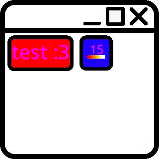

# Dashey

  <picture>
    <source srcset="icon.svg" type="image/svg+xml">
    
  </picture>

Dashey is an unsandboxed TurboWarp/Scratch VM extension for building draggable, resizable, multi-window dashboards from blocks.

## Files

- `dashey.js` — the single merged extension build (`id: dashey`).
- `icon.png` and `icon.svg` — the project logo assets. `dashey.js` embeds the SVG as the extension `iconURI`, and the README displays the PNG/SVG logo assets.

## What was fixed and improved

- Removed the old separate versioned build and merged the best runtime into one `dashey.js` extension.
- Removed old versioned branding from user-facing extension metadata, errors, docs, and runtime globals.
- Rebuilt window chrome so dashboard windows are reliably draggable with pointer events, touch/mouse/pen support, pointer capture, viewport clamping, and proper z-index focus.
- Rebuilt window resizing so the bottom-right handle works with mouse, touch, and pen input.
- Fixed persistence/import/load hydration: saved widgets are recreated before rendering, so restored dashboards no longer fail with empty or broken windows.
- Added migration support for dashboards saved by previous development builds.
- Added safer control behavior so close/minimize/fullscreen buttons do not accidentally start a drag.
- Embedded the repository SVG logo into the extension build.

## Loading

1. Open TurboWarp or another Scratch VM mod that supports unsandboxed custom extensions.
2. Load `dashey.js`.
3. Use the dashboard blocks to create a dashboard, add widgets, and show the dashboard.

## Quick smoke-test script idea

Create a project that runs these blocks in order:

1. Create dashboard `main` titled `Dashey Test`.
2. Add a `text` widget with ID `hello`.
3. Show dashboard `main`.
4. Drag the window by the header and resize it from the lower-right corner.
5. Reload the extension/project and confirm the dashboard restores without errors.
